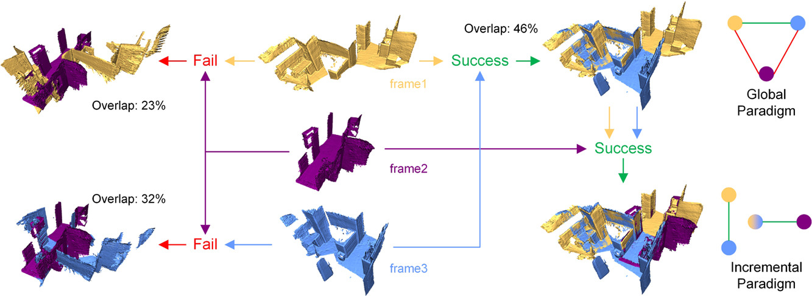

# Incremental Multiview Point Cloud Registration with Two-stage Candidate Retrieval

This is an official implementation of [*Incremental Multiview Point Cloud Registration with Two-stage Candidate Retrieval*](https://www.sciencedirect.com/science/article/pii/S0031320325003656) that is accepted to Pattern Recognition.

## Abstract
Multiview point cloud registration serves as a cornerstone of various computer vision tasks. Previous approaches typically adhere to a global paradigm, where a pose graph is initially constructed followed by motion synchronization to determine the absolute pose. However, this separated approach may not fully leverage the characteristics of multiview registration and might struggle with low-overlap scenarios. In this paper, we propose an incremental multiview point cloud registration method that progressively aligns all scans to a growing meta-shape. This procedure increases the overlap between point cloud pairs, enhancing the overall multiview registration performance. To determine the incremental ordering, we employ a two-stage coarse-to-fine strategy for point cloud candidate retrieval. The first stage involves the coarse selection of scans based on neighbor fusion-enhanced global aggregation features, while the second stage further reranks candidates through geometric-based matching. Additionally, we apply a transformation averaging technique to mitigate accumulated errors during the registration process. Finally, we utilize a reservoir sampling-based technique to address density variance issues while reducing computational load. Comprehensive experimental results across various benchmarks validate the effectiveness and generalization of our approach.



## Installation
First, create the conda environment.
```
conda create -n imvr python=3.8
conda activate imvr
pip install -r requirements.txt
```
The code has been tested with Ubuntu 20.04, CUDA 11.7, Driver Version: 535.247.01, GeForce RTX 1080Ti, other platforms have not been tested but should work as well.

## Data Preparation

The data can be found from [SGHR](https://github.com/WHU-USI3DV/SGHR), the `.pkl` files can be found at [SGHR/train/pkls](https://github.com/WHU-USI3DV/SGHR/tree/master/train/pkls), you need to remove the `test_` prefix for three test `.pkl` files. Both our `train` and `val` folders correspond to the `3dmatch_train` in SGHR, we provide a [script](tools/move_val.sh) in `tools` to help move the subfolders.

Please organize the data to `./data` following the example data structure as:
```
data/
├── 3dmatch/
    └── kitchen/
        ├── PointCloud/
            ├── cloud_bin_0.ply
            ├── gt.log
            └── gt.info
        ├── yoho_desc/
            └── 0.npy
        └── Keypoints_PC_yoho/
            └── cloud_bin_0Keypoints.txt
├── eth/
├── scannet/
├── train/
├── val/
├── 3dmatch.pkl
├── eth.pkl
├── scannet.pkl
├── train.pkl
└── val.pkl
```
If you want to use the FCGF descriptor, you need to extract the FCGF descriptor/keypoints and create two subfolders for FCGF under each scene.  
```
data/
└── 3dmatch/
    └── kitchen/
        ├── PointCloud/
        ├── yoho_desc/
            └── 0.npy
        ├── fcgf_desc/
            └── 0.npy
        ├── Keypoints_PC_fcgf/
            └── cloud_bin_0Keypoints.txt
        └── Keypoints_PC_yoho/
            └── cloud_bin_0Keypoints.txt
```

Then generate the cache files for training by:
```
python tools/create_overlap_cache.py
```
The generated files will located in `data/vlad_yoho_cache` or `data/vlad_fcgf_cache` folder.

## Train
Train the overlap model.
```
python train_cache.py --config config/netvlad_yoho.yaml
```

## Test
We provide the pre-trained model checkpoints in release page, download and put the weight files to `./ckpt` folder.
### YOHO Descriptor on 3DMatch/ScanNet/ETH
```
python test_imvr.py --config config/3dmatch_yoho_vlad.yaml
python test_imvr.py --config config/scannet_yoho_vlad.yaml
python test_imvr.py --config config/eth_yoho_vlad.yaml
```
### FCGF Descriptor on 3DMatch
```
python test_imvr.py --config config/3dmatch_fcgf_vlad.yaml
```

## Cite
If you find this code useful for your work, please consider citing:
```
@article{li2025incremental,
  title={Incremental multiview point cloud registration with two-stage candidate retrieval},
  author={Li, Shiqi and Zhu, Jihua and Xie, Yifan and Zhu, Mingchen},
  journal={Pattern Recognition},
  pages={111705},
  year={2025},
  publisher={Elsevier}
}
```

## Acknowledgement
We thank the authors of the [LMVR](https://github.com/zgojcic/3D_multiview_reg), [MultiReg](https://github.com/yewzijian/MultiReg), [SGHR](https://github.com/WHU-USI3DV/SGHR), [FCGF](https://github.com/chrischoy/FCGF) for open sourcing their codes.